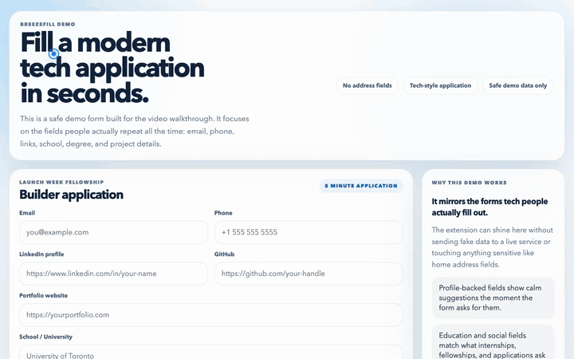

# BreezeFill

BreezeFill is a polished browser extension that suggests autofill values while users type and asks whether new form responses should be saved for later.



[Live website demo](https://breezefill.vercel.app/)

[Download BreezeFill ZIP](https://github.com/ammarjmahmood/breezefill/archive/refs/heads/main.zip)

Fast install: download the ZIP, unzip it, open `chrome://extensions`, turn on **Developer mode**, click **Load unpacked**, and select the unzipped folder.

## Start here

If you want the easiest step-by-step version, open [START_HERE.md](/Users/ammarmahmood/Documents/Codex/2026-04-28/okay-build-me-a-new-project/START_HERE.md).

## What it does

- Suggests autofill responses on text-like form fields.
- Uses profile values for common fields like name, email, phone, address, company, and website.
- Learns site-specific answers and can reuse them the next time the same field shows up.
- Prompts before saving new responses, so the extension stays predictable.
- Lets users manage everything from a compact popup and a fuller settings page.
- Handles iframes, open shadow DOM, native selects, and a shared adapter layer for major job application platforms.

## Project structure

- `manifest.json`: Manifest V3 extension entrypoint.
- `background.js`: Initializes defaults and handles save / mute messages.
- `content-script.js`: Detects form fields, shows suggestions, and displays save prompts.
- `content-styles.css`: In-page UI styling for suggestion menus, prompts, and toast messages.
- `popup.*`: Small control surface for quick profile edits and extension toggles.
- `options.*`: Full settings page for profile fields, behavior, and saved response management.
- `assets/`: Brand mark and packaged toolbar icons.
- `lib/`: Shared constants, field matching heuristics, and storage utilities.
- `tests/`: Playwright browser tests for the unpacked extension.
- `scripts/`: Local test server and Safari packaging helpers.
- `qa/`: Manual QA matrix and release templates.

## Fast install

If someone just wants to use BreezeFill in Chrome right now:

Direct download:

[Download the latest BreezeFill ZIP](https://github.com/ammarjmahmood/breezefill/archive/refs/heads/main.zip)

Then:

1. Download the repo ZIP.
2. Unzip it.
3. Open `chrome://extensions`.
4. Turn on **Developer mode**.
5. Click **Load unpacked**.
6. Select the unzipped folder you just downloaded. GitHub will usually name it `breezefill-main`.

Important:

- no build step is required for install
- `npm install` is only needed for tests and release tooling

## Local verification

Run the syntax check:

```bash
npm run check
```

Run the extension browser suite:

```bash
npm run test:e2e
```

That suite covers:

- profile-backed suggestions
- native select suggestions
- save prompts and remembered values
- shadow DOM inputs
- ATS-style application markup via the shared adapter layer

## Local test page

Start the local server:

```bash
npm run test:server
```

Then open:

- [http://127.0.0.1:4173/test-form.html](http://127.0.0.1:4173/test-form.html)
- [http://127.0.0.1:4173/test-form.html?ashby_jid=demo](http://127.0.0.1:4173/test-form.html?ashby_jid=demo)
- [http://127.0.0.1:4173/docs/](http://127.0.0.1:4173/docs/)

If you only want to preview the launch site and docs locally, `npm run site:preview` uses the same static server.

The second URL activates the application-form adapter path on the local fixture page.

## Install in Safari

The core code is written as a standard Web Extension, so the same project can be converted for Safari:

```bash
npm run safari:convert
```

### Mac Safari

1. Run `npm run safari:convert`.
2. Open the generated Xcode project in `build/safari/BreezeFill`.
3. In Xcode, pick your Apple team under Signing.
4. Build and run the macOS app target.
5. Open Safari on your Mac and enable BreezeFill in Safari extension settings.

### iPhone and iPad Safari

If you want BreezeFill on iOS mobile, Safari is the path.

1. Run:

```bash
bash scripts/package-safari.sh --ios-only
```

2. Open the generated Xcode project in `build/safari/BreezeFill`.
3. In Xcode, set your Apple team and fix the bundle identifier if Xcode asks.
4. Connect your iPhone or choose an iPhone or iPad simulator.
5. Run the iOS app target from Xcode.
6. On the device, open `Settings` → `Apps` → `Safari` → `Extensions` → `BreezeFill`.
7. Turn on `Allow Extension`.
8. Open Safari and test BreezeFill on a normal web form.

Important:

- iPhone and iPad support is for `Safari`, not Chrome on iOS.
- This works on web pages opened in Safari, not inside arbitrary native iPhone apps.
- For other people to install it on iPhone, ship it through `TestFlight` or the `App Store`.

More details are in [SAFARI.md](/Users/ammarmahmood/Documents/Codex/2026-04-28/okay-build-me-a-new-project/SAFARI.md).

## Launch site

This repo includes a Vercel-ready launch site in [docs/index.html](/Users/ammarmahmood/Documents/Codex/2026-04-28/okay-build-me-a-new-project/docs/index.html) plus a hosted privacy page in [docs/privacy/index.html](/Users/ammarmahmood/Documents/Codex/2026-04-28/okay-build-me-a-new-project/docs/privacy/index.html).

It is now also Vercel-ready through [vercel.json](/Users/ammarmahmood/Documents/Codex/2026-04-28/okay-build-me-a-new-project/vercel.json).

Fastest deployment path:

1. Push the repo to GitHub.
2. Import the repo into Vercel.
3. Keep the repo root as the project root.
4. Do not add a build command.
5. Deploy.

That gives you a clean public website for launches and a privacy-policy URL for the Chrome Web Store at `/privacy`.

## Launch plan

The repo now also includes a practical launch guide in [LAUNCH.md](/Users/ammarmahmood/Documents/Codex/2026-04-28/okay-build-me-a-new-project/LAUNCH.md) covering:

- the easiest GitHub install path
- Vercel deployment
- GitHub Pages as a fallback option
- Chrome Web Store submission
- Product Hunt launch timing and copy

## QA target

The project now includes a release-oriented QA plan in [qa/README.md](/Users/ammarmahmood/Documents/Codex/2026-04-28/okay-build-me-a-new-project/qa/README.md), a cross-site matrix in [qa/site-matrix.md](/Users/ammarmahmood/Documents/Codex/2026-04-28/okay-build-me-a-new-project/qa/site-matrix.md), and a reusable results log in [qa/results-template.md](/Users/ammarmahmood/Documents/Codex/2026-04-28/okay-build-me-a-new-project/qa/results-template.md).
